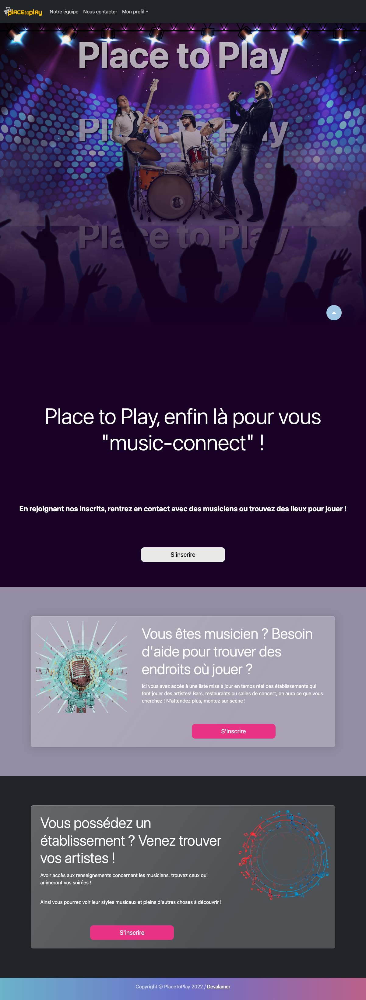
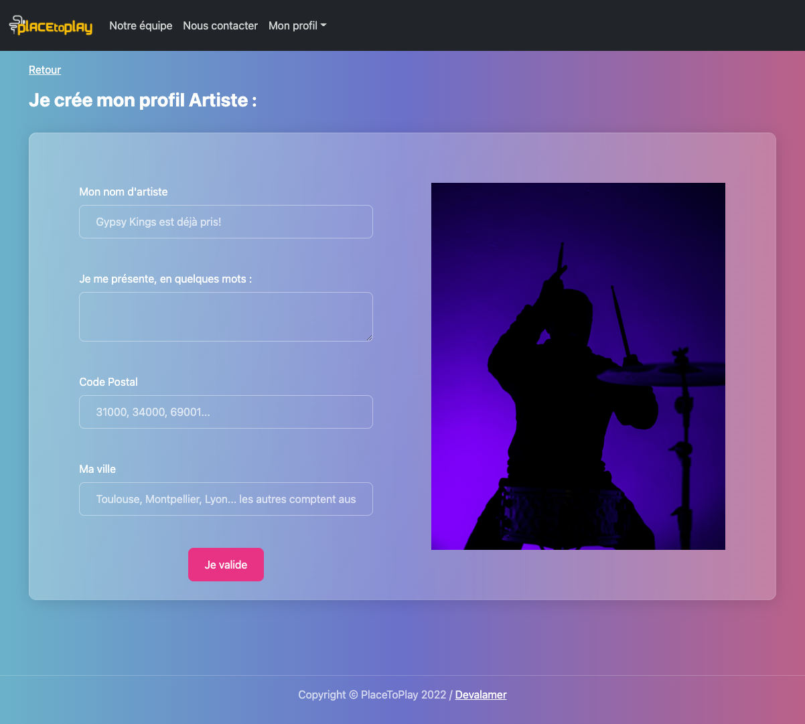
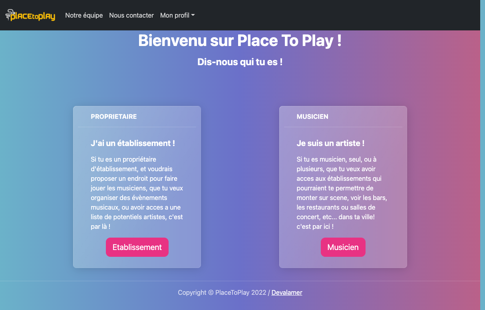

# Place to Play

 

## Team Vocal_15

 

# Place to Play

Projet final cloturant la session Fullstack summer 22 de ✨ **The Hacking Project.** ✨
[Visiter Place to Play 🎤]()

Imaginez que vous êtes un musicien passioné, rêvant tous les soirs de partager son art avec le public mais ne sachant pas comment démarcher les lieux où les gens se retrouvent. Ou bien, que vous êtes un patron d'établissement enviant vos concurrents capables de rassembler un public qui dansera et donc consommera plus, mais vous ne savez pas comment trouver les artistes qui créeront l'émulation. 
C'est pourquoi nous avons pensé ✨ **Place to Play** ✨, une application géniale permettant aux artistes et établissements de se connecter simplement en optimisant leurs recherches face à leurs attentes.

## Prévisualisation:

### Page d'accueil:

### Page d'enregistrement:

### Page création profil pour un musicien:

[User Experience](#User-Experience)

[Features](#features)

[Authors Details](#authors-details)

[Show your support](#show-your-support)

[User Experience](#User-Experience)

## User Experience

↳ [Miro](https://miro.com/app/board/uXjVPaZVxQc=/?share_link_id=830918286609)

 

## Features
- En tant que visiteur, je peux consulter la page d'acceuil et m'inscrire
- En tant que visiteur, je peux m'inscrire comme artiste ou établissement
- En tant qu'utilisateur authentifié, je peux accéder à mon profil, compléter mon profil, modifier mes informations, supprimer mon profil
- En tant qu'utilisateur authentifié, consulter la liste des artistes/établissements inscrits

 
 

## Auteurs de ce projet:

- [@Chreees79](https://github.com/Chreees79)
- [@GuillaumeBrthlt](https://github.com/GuillaumeBrthlt)
- [@linahello](https://github.com/linahello)
- [@LoiseauB](https://github.com/LoiseauB)
- [@xko0](https://github.com/xko0) 
 

## Soutenez-nous!

Donnez-nous une ⭐ sur Github --cela aide!

 

